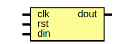

# Testbench de D Flip-Flop con Cocotb

## Descripción General

Este proyecto implementa un testbench de verificación para un D flip-flop digital utilizando Cocotb, una biblioteca de Python para simulación de HDL. El testbench sigue un patrón similar al UVM (Universal Verification Methodology), estructurado en componentes modulares para generar estímulos aleatorios, inyectarlos al DUT, monitorear respuestas y comparar resultados esperados.

## Archivos en la Carpeta

- **dff_tb.py**: Archivo principal del testbench en Python. Contiene las clases del testbench y la función de prueba principal.
- **runner_dff.py**: Runner de Cocotb que construye y lanza la simulación (usa `cocotb_tools.runner`). Reemplaza el uso antiguo de Makefile.
- **dff.sv**: Módulo Verilog del Device Under Test (DUT), un D flip-flop síncrono con reset.
- **sim_build/**: Directorio de salida donde los runners colocan artefactos de la simulación (VCD/FST, archivos de build). Algunos scripts también pueden generar `dump.vcd` o `vsim.vcd` dependiendo del simulador.

## Descripción del DUT

El DUT es un módulo Verilog llamado `dff` que implementa un flip-flop D síncrono con reset asíncrono. La salida `dout` se actualiza en el flanco positivo del reloj `clk` con el valor de `din`, a menos que `rst` esté activo, en cuyo caso `dout` se resetea a 0. Es un circuito secuencial. La simulación la gestiona el runner (`runner_dff.py`) y puede ejecutarse con Verilator, Icarus (Icarus Verilog), Questa/ModelSim u otros simuladores soportados según la configuración de `SIM`.

### Entity: dff 
- **File**: dff.sv

### Diagram

### Ports

| Port name | Direction | Type  | Description |
| --------- | --------- | ----- | ----------- |
| clk       | input     |       | Reloj de entrada |
| rst       | input     |       | Reset asíncrono (activo alto) |
| din       | input     |       | Dato de entrada |
| dout      | output    | reg   | Dato de salida |

## Proceso de Verificación (Patrón UVM-like)

El testbench sigue un flujo de verificación estructurado similar a UVM, dividido en las siguientes fases/componentes:

1. **Transaction**: Clase que representa los datos de entrada/salida (din, dout). Incluye randomización para generar estímulos aleatorios.

2. **Generator**: Genera transacciones aleatorias y las envía a una cola. Espera eventos para sincronizar con el scoreboard.

3. **Driver**: Recibe transacciones de la cola y las aplica a las entradas del DUT. Aplica reset inicial y maneja la señalización de `din` en flancos de reloj.

4. **Monitor**: Muestrea las salidas del DUT y las entradas actuales en flancos de reloj, creando transacciones de respuesta que envía al scoreboard.

5. **Scoreboard**: Compara los resultados muestreados con los valores esperados (dout debe igualar din del ciclo anterior, considerando reset). Registra PASS/FAIL y notifica al generator para continuar.

El flujo es asíncrono y concurrente, con tareas corriendo en paralelo usando `cocotb.start_soon`.

## Detalles de Timing

El timing en la simulación está controlado por flancos de reloj y ciclos de reloj de Cocotb para asegurar la sincronización correcta con el DUT secuencial:

- **Driver**: El driver aplica un reset inicial (en el código espera un flanco de reloj, pone `rst=1`, espera 5 ciclos con `ClockCycles(dut.clk, 5)` y luego limpia `rst`). Para cada transacción el driver toma la `din` de la transacción, la aplica en el flanco de bajada (`falling_edge`) y espera el flanco de subida (`rising_edge`) para que el DUT la capture.

- **Monitor**: El monitor espera el `rising_edge` y usa `ReadOnly()` para leer señales estables del DUT (`din`, `dout`) después del flanco, empaquetando esos valores en transacciones que envía al `Scoreboard`.

- **Test Principal / Terminación**: El test no depende de un tiempo de simulación fijo. La terminación es impulsada por transacciones:
	- El `Generator` crea `n_events` transacciones y las coloca en la cola del driver.
	- El `Scoreboard` consume las transacciones muestreadas por el monitor y, tras procesarlas, notifica mediante un `Event` para continuar.
	- El test espera a que el generador termine y comprueba que tanto `queue_drv` como `queue_mon` estén vacías; cuando ambas colas están vacías el test cancela los procesos de driver/monitor y finaliza.

	En el código de `dff_tb.py` la señal de reloj se crea con `Clock(dut.clk, 10, 'ns')` (periodo 10 ns), pero esto es sólo el periodo del reloj; la lógica de terminación se basa en colas y eventos, no en un `Timer` fijo.

## Cómo Ejecutar

- **Entorno**: activa tu entorno virtual si aún no lo has hecho:

	```bash
	source .venv/bin/activate
	```

- **Con `uv`**: si gestionas el entorno con `uv`, puedes ejecutar los tests directamente con:

	```bash
	uv run pytest
	```


- **Ejecutar con el runner (`runner_dff.py`)**: el repositorio ahora usa `runner_dff.py` para construir y ejecutar la simulación. Desde la carpeta del proyecto ejecuta:

	```bash
	cd Course_4/2_DFF
	python runner_dff.py
	```

	- Por defecto el runner usa `verilator`. Para elegir otro simulador exporta la variable `SIM` antes de ejecutar. Valores soportados: `verilator`, `icarus`/`iverilog`, `questa`/`modelsim`.

	```bash
	# Usar Icarus (iverilog)
	SIM=icarus python runner_dff.py

	# Usar Questa/ModelSim
	SIM=questa python runner_dff.py
	```


- **Ejecutar con `pytest`**: también puedes lanzar el `test_dff` desde `pytest` (el runner declarado en `runner_dff.py` es reconocible como test). Ejemplos:

	```bash
	# Ejecutar el test de forma explícita
	pytest -q Course_4/2_DFF/runner_dff.py::test_dff

	# Ejecutar todos los tests en la carpeta
	pytest -q Course_4/2_DFF
	```

	Si usas `uv` para gestionar el entorno, antepone `uv run`:

	```bash
	uv run pytest -q Course_4/2_DFF/runner_dff.py::test_dff
	# o ejecutar el runner directamente
	uv run python Course_4/2_DFF/runner_dff.py
	```

-- **Ver ondas**: los ficheros de ondas se generan en `sim_build/` o con nombres como `dump.vcd`, `vsim.vcd`, `vsim.fst`, o `trace.fst` según el simulador. Abre el fichero VCD/FST con GTKWave o Surfer para inspección.

## Dependencias

- Python >= 3.12
- Cocotb >= 2.0.1
- Cocotb-bus >= 0.3.0
- Cocotb-coverage >= 2.0
- Icarus Verilog (para simulación HDL)
- GTKWave o Surfer (para visualizar archivos VCD/FST). Surfer: https://github.com/surfer-project/surfer

Este setup permite una verificación automatizada y reproducible del D flip-flop.