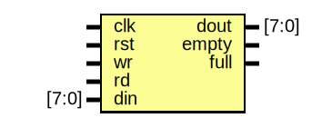

# Testbench de FIFO con Cocotb

## Descripción General

Este proyecto implementa un testbench de verificación para un FIFO (First In, First Out) digital utilizando Cocotb, una biblioteca de Python para simulación de HDL. El testbench sigue un patrón similar al UVM (Universal Verification Methodology), estructurado en componentes modulares para generar estímulos aleatorios, inyectarlos al DUT, monitorear respuestas y comparar resultados esperados.

## Archivos en la Carpeta

- **fifo_tb.py**: Archivo principal del testbench en Python. Contiene las clases del testbench y la función de prueba principal.
- **makefile**: Archivo de construcción para compilar y ejecutar la simulación usando Icarus Verilog y Cocotb.
- **fifo.sv**: Módulo Verilog del Device Under Test (DUT), un FIFO síncrono con señales de escritura, lectura, vacío y lleno.
- **waveform_fifo.vcd**: Archivo de ondas generado por la simulación (creado después de ejecutar).

## Descripción del DUT

El DUT es un módulo Verilog llamado `FIFO` que implementa un buffer FIFO síncrono de 16 elementos de 8 bits cada uno. Las operaciones de escritura y lectura están controladas por las señales `wr` y `rd`, con indicadores `empty` y `full` para el estado del buffer. El FIFO se resetea asíncronamente con `rst`. Es un circuito secuencial, y se simula usando Icarus Verilog.

### Entity: FIFO 
- **File**: fifo.sv

### Diagram

### Ports

| Port name | Direction | Type  | Description |
| --------- | --------- | ----- | ----------- |
| clk       | input     |       | Reloj de entrada |
| rst       | input     |       | Reset asíncrono (activo alto) |
| wr        | input     |       | Señal de escritura (activo alto) |
| rd        | input     |       | Señal de lectura (activo alto) |
| din       | input     | [7:0] | Dato de entrada (8 bits) |
| dout      | output    | [7:0] | Dato de salida (8 bits) |
| empty     | output    |       | Indicador de FIFO vacío |
| full      | output    |       | Indicador de FIFO lleno |

## Proceso de Verificación (Patrón UVM-like)

El testbench sigue un flujo de verificación estructurado similar a UVM, dividido en las siguientes fases/componentes:

1. **Transaction**: Clase que representa los datos de entrada/salida (wr, rd, din, dout, empty, full). Incluye randomización para generar estímulos aleatorios, con restricciones para evitar operaciones simultáneas de escritura y lectura.

2. **Generator**: Genera transacciones aleatorias y las envía a una cola. Espera eventos para sincronizar con el scoreboard.

3. **Driver**: Recibe transacciones de la cola y las aplica a las entradas del DUT. Aplica reset inicial y maneja la señalización de `wr`, `rd` y `din` en flancos de reloj.

4. **Monitor**: Muestrea las salidas del DUT y las entradas actuales en flancos de reloj, creando transacciones de respuesta que envía al scoreboard.

5. **Scoreboard**: Compara los resultados muestreados con los valores esperados, manteniendo una lista interna que simula el contenido del FIFO. Verifica operaciones de escritura (agrega a la lista) y lectura (compara y remueve de la lista), considerando estados de vacío y lleno. Registra PASS/FAIL y notifica al generator para continuar.

El flujo es asíncrono y concurrente, con tareas corriendo en paralelo usando `cocotb.start_soon`.

## Detalles de Timing

El timing en la simulación está controlado por flancos de reloj y ciclos de reloj de Cocotb para asegurar la sincronización correcta con el DUT secuencial:

- **Driver**: Aplica reset durante 5 ciclos de reloj. Luego, para cada transacción, establece `wr`, `rd` y `din`, y espera flancos de reloj positivos para que el DUT procese las operaciones. Limpia las señales después de otro flanco.
- **Monitor**: Espera flancos de reloj positivos para muestrear las salidas (que se actualizan en el flanco). Muestrea entradas y salidas, enviando la transacción.
- **Test Principal**: Corre por `Timer(820, unit="ns")`, suficiente para 40 pruebas con un reloj de 10ns de período (aprox. 82 ciclos de reloj).

Esto asegura que la verificación se sincronice correctamente con el comportamiento secuencial del FIFO, evitando muestreo prematuro o tardío.

## Cómo Ejecutar

1. Asegúrate de tener el entorno virtual activado: `source .venv/bin/activate` (usando uv).
2. En el directorio del proyecto: `cd Course_4/fifo`
3. Ejecuta: `make`
4. Revisa los logs en la consola y el archivo `waveform_fifo.vcd` para ver los resultados en gtkwave.

## Dependencias

- Python >= 3.12
- Cocotb >= 2.0.1
- Cocotb-bus >= 0.3.0
- Cocotb-coverage >= 2.0
- Icarus Verilog (para simulación HDL)
- Gtkwave (para visualizar archivos VCD)

Este setup permite una verificación automatizada y reproducible del FIFO.