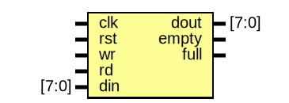

# Testbench de FIFO con Cocotb

## Descripción General

Este proyecto implementa un testbench de verificación para un FIFO (First In, First Out) digital utilizando Cocotb, una biblioteca de Python para simulación de HDL. El testbench sigue un patrón similar al UVM (Universal Verification Methodology), estructurado en componentes modulares para generar estímulos aleatorios, inyectarlos al DUT, monitorear respuestas y comparar resultados esperados.

## Archivos en la Carpeta

- **fifo_tb.py**: Archivo principal del testbench en Python. Contiene las clases del testbench y la función de prueba principal.
- **runner_fifo.py**: Script runner para lanzar las pruebas de Cocotb/`pytest` (ej. `SIM=icarus uv run pytest -s -q runner_fifo.py`).
- **fifo.sv**: Módulo Verilog del Device Under Test (DUT), un FIFO síncrono con señales de escritura, lectura, vacío y lleno.
- **waveform_fifo.vcd**: Archivo de ondas generado por la simulación (creado después de ejecutar).

## Descripción del DUT

El DUT es un módulo Verilog llamado `fifo` que implementa un buffer FIFO síncrono de 16 elementos de 8 bits cada uno. Las operaciones de escritura y lectura están controladas por las señales `wr` y `rd`, con indicadores `empty` y `full` para el estado del buffer. El FIFO se resetea de forma síncrona con `rst` en el flanco positivo del reloj. Es un circuito secuencial, y se simula usando Icarus Verilog.

### Entity: FIFO 
- **File**: fifo.sv

### Diagram

### Ports

| Port name | Direction | Type  | Description |
| --------- | --------- | ----- | ----------- |
| clk       | input     |       | Reloj de entrada |
| rst       | input     |       | Reset síncrono (activo alto) |
| wr        | input     |       | Señal de escritura (activo alto) |
| rd        | input     |       | Señal de lectura (activo alto) |
| din       | input     | [7:0] | Dato de entrada (8 bits) |
| dout      | output    | [7:0] | Dato de salida (8 bits) |
| empty     | output    |       | Indicador de FIFO vacío |
| full      | output    |       | Indicador de FIFO lleno |

## Proceso de Verificación (Patrón UVM-like)

El testbench sigue un flujo de verificación estructurado similar a UVM, dividido en las siguientes fases/componentes:

1. **Transaction**: Clase que representa los datos de entrada/salida (wr, rd, din, dout, empty, full). Incluye randomización para generar estímulos aleatorios, con restricciones para evitar operaciones simultáneas de escritura y lectura.

2. **Generator**: Genera transacciones aleatorias y las envía a una cola. Espera eventos para sincronizar con el scoreboard.

3. **Driver**: Recibe transacciones de la cola y las aplica a las entradas del DUT. Aplica reset inicial y maneja la señalización de `wr`, `rd` y `din` en flancos de reloj.

4. **Monitor**: Muestrea las salidas del DUT y las entradas actuales en flancos de reloj, creando transacciones de respuesta que envía al scoreboard.

5. **Scoreboard**: Compara los resultados muestreados con los valores esperados, manteniendo una lista interna que simula el contenido del FIFO. Verifica operaciones de escritura (agrega a la lista) y lectura (compara y remueve de la lista), y notifica al generator para continuar.

El flujo es asíncrono y concurrente, con tareas corriendo en paralelo usando `cocotb.start_soon`.

## Detalles de Timing

El testbench sincroniza explícitamente las tareas con el reloj del DUT para evitar muestreos fuera de tiempo y comportamientos indeterminados.

- **Reset y Driver**: el `Driver` aplica un reset inicial de 2 ciclos de reloj. Tras el reset, cada transacción se aplica alineada a flancos de reloj: se ponen `wr`/`rd`/`din` en el flanco negativo y se mantienen hasta el flanco positivo para que el DUT registre la operación.
- **Período de reloj**: el banco de pruebas usa un período de reloj de 10 ns. Cuando se espera un número N de ciclos se recomienda usar `RisingEdge(clk)` N veces o `Timer(N * 10, unit="ns")` si se desea control por tiempo absoluto.
- **Muestreo en Monitor**: el `Monitor` muestrea señales en el flanco positivo y luego usa `ReadOnly()` antes de capturar las señales del DUT.
- **Timing entre transacciones (Generator)**: el `Generator` no introduce esperas adicionales entre transacciones; la sincronización se hace con el evento del scoreboard.
- **Duración de las pruebas**: la finalización del test no se basa en un `Timer` fijo sino en el número de transacciones generadas y en el vaciado de las colas. En `fifo_tb.py` el `number_of_transactions` se calcula según `test_type` (por ejemplo `len(dut.mem)` para el test `full`, 2 para `empty`, etc.), el `Generator` genera esas transacciones y el test espera hasta que `queue_drv` y `queue_mon` queden vacías antes de cancelar los procesos (`driver_process.cancel()`, `monitor_process.cancel()`). Para alargar la prueba aumenta `number_of_transactions` o ajusta la lógica del `Generator`.
- **Protecciones en Scoreboard**: el `Scoreboard` no filtra operaciones por `full` o `empty`; valida escrituras o lecturas según `wr`/`rd` y compara con su lista interna.

Estas prácticas reducen falsos negativos por muestreo erróneo y aumentan la robustez del testbench frente a condiciones límite.

## Tests adicionales realizados

Estos casos cubren bordes clasicos y ayudan a validar flags, orden y punteros del FIFO:

- [x] **Full**: escribir hasta llenar y observar `full=1` durante el llenado.
- [x] **Empty / underflow**: intentar leer desde FIFO vacio y observar `empty=1`.
- [x] **Fill and drain completo**: llenar N elementos y luego leer N; confirma orden FIFO exacto.
- [ ] **Alternado write/read**: patron escribir/leer intercalado para detectar desalineos de punteros.
- [ ] **Burst write / burst read**: rafagas largas de escritura seguidas de rafagas largas de lectura; expone problemas de wrap-around.
- [ ] **Wrap-around**: escribir mas de la profundidad para forzar vuelta de punteros; el orden debe mantenerse.
- [ ] **Reset en medio**: aplicar reset con datos en cola; al salir, `empty=1`, `full=0` y cola vacia.
- [ ] **Datos extremos**: probar `din=0` y `din=255` (8 bits) para validar limites.

## Cómo Ejecutar (pytest / entorno virtual)

1. Activar el entorno virtual (elige el método que uses):

```
source .venv/bin/activate
# o si usas `uv`:
uv .venv
```

2. Para ejecutar las pruebas directamente usando el runner de pytest/Cocotb (sin Makefile):

```
cd Course_4/3_FIFO
SIM=icarus uv run pytest -s -q runner_fifo.py
```

Notas:
- Usa el runner (`runner_fifo.py`) que tienes en el directorio; sustituye el nombre si empleas otro script runner.
- El comando recomendado es exactamente: `SIM=icarus uv run pytest -s -q runner_fifo.py`.
- El flag `-s` muestra la salida de logs en consola, y `-q` reduce la verbosidad de pytest.

## Dependencias

- Python >= 3.12
- Cocotb >= 2.0.1
- Cocotb-bus >= 0.3.0
- Cocotb-coverage >= 2.0
- Icarus Verilog (para simulación HDL)
- GTKWave o Surfer (para visualizar archivos VCD/FST). Surfer: https://github.com/surfer-project/surfer

Este setup permite una verificación automatizada y reproducible del FIFO.
 