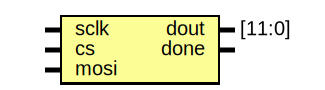
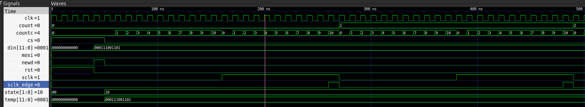

# Testbench de SPI con Cocotb: Master, Slave y Comunicación

## Descripción General

Este proyecto implementa un testbench de verificación para módulos SPI (Serial Peripheral Interface) digitales utilizando Cocotb, una biblioteca de Python para simulación de HDL. El testbench sigue un patrón similar al UVM (Universal Verification Methodology), estructurado en componentes modulares para generar estímulos aleatorios, inyectarlos al DUT, monitorear respuestas y comparar resultados esperados.

El proyecto está dividido en tres partes principales:
- **SPI Master**: Módulo que inicia y controla la comunicación, transmitiendo datos en serie.
- **SPI Slave**: Módulo que recibe los datos transmitidos por el Master.
- **Top Level**: Sistema completo que conecta Master y Slave, verificando la comunicación bidireccional.

**Nota**: Actualmente, se ha implementado y verificado el **Master**. El **Slave** y la **comunicación completa** están en desarrollo, con correcciones basadas en análisis de timing.

## Archivos en la Carpeta

- **spi_tb.py**: Archivo principal del testbench en Python. Contiene las clases del testbench y la función de prueba principal.
- **makefile**: Archivo de construcción para compilar y ejecutar la simulación usando Icarus Verilog y Cocotb.
- **spi_my.sv**: Módulo SystemVerilog del SPI Master (DUT).
- **spi_slave.sv**: Módulo SystemVerilog del SPI Slave (en desarrollo).
- **top_master_slave.sv**: Módulo top-level que conecta Master y Slave.
- **spi.sv**: Archivo de solución del curso (no utilizado actualmente).
- **waveform_spi.vcd**: Archivo de ondas generado por la simulación (creado después de ejecutar).
- **spi_my.svg**: Diagrama del SPI Master.
- **spi_slave.svg**: Diagrama del SPI Slave.
- **top_master_slave.svg**: Diagrama del sistema top-level.

## SPI Master

### Descripción del DUT

El DUT del Master es un módulo SystemVerilog llamado `SPI` que implementa un **SPI Master** capaz de transmitir datos de 12 bits en serie. El módulo genera su propia señal de reloj SPI (`sclk`) derivada del reloj del sistema, y utiliza una máquina de estados para controlar la transmisión. Los datos se envían MSB first (bit más significativo primero) a través de la señal `mosi` (Master Out Slave In). La señal `cs` (Chip Select) se activa (baja) durante la transmisión.


### Entity: SPI Master
- **File**: spi_my.sv

### Ports

| Port name | Direction | Type   | Description |
| --------- | --------- | ------ | ----------- |
| clk       | input     |        | Reloj del sistema (100 MHz) |
| rst       | input     |        | Reset síncrono (activo alto) |
| newd      | input     |        | Nueva solicitud de dato (activo alto) |
| din       | input     | [11:0] | Dato de entrada a transmitir (12 bits) |
| sclk      | output    | reg    | Reloj SPI generado (~5 MHz, divide por 20) |
| mosi      | output    | reg    | Master Out Slave In - línea de datos serial |
| cs        | output    | reg    | Chip Select (activo bajo durante transmisión) |

### Características del Diseño

- **Generación de SCLK**: El reloj SPI se genera dividiendo el reloj del sistema. `sclk` oscila cada 10 ciclos de `clk` (countc), creando una frecuencia aproximada de 5 MHz. Importante: `sclk` solo oscila cuando `cs = 0` (durante transmisión activa), permaneciendo en `0` cuando está inactivo.

- **Máquina de Estados**: 
  - **idle**: Estado de reposo. `cs = 1`, esperando señal `newd = 1` para iniciar transmisión.
  - **send**: Estado de transmisión. Envía los 12 bits secuencialmente en cada flanco positivo de `sclk` (detectado internamente), MSB first.

- **Temporización**: Utiliza un contador interno `count` para rastrear los bits transmitidos (0-11) y un contador `countc` para generar `sclk`.

- **Detección de Edges de SCLK**: Para evitar problemas de timing/skew, se utiliza un `wire` (`sclk_edge`) que combina las condiciones `countc == 10 && sclk == 1'b1`. Esto permite que la máquina de estados se ejecute en `@(posedge clk)` (reloj del sistema) en lugar de `@(posedge sclk)`, previniendo violaciones de timing cuando `sclk` no está perfectamente sincronizado con el reloj del sistema. En contraste, implementaciones que usan `@(posedge sclk)` directamente pueden sufrir de skew de tiempo, especialmente en diseños donde `sclk` se genera internamente.

### Proceso de Verificación para el Master

El testbench para el Master sigue un flujo de verificación estructurado similar a UVM:

1. **Transaction**: Clase que representa los datos de entrada/salida del SPI (`newd`, `din`, `sclk`, `mosi`, `cs`, `dout`). Incluye randomización para generar valores aleatorios de `din` (rango 0-4095, 12 bits) usando `cocotb_coverage.crv.Randomized`.

2. **Generator**: Genera transacciones aleatorias (configuradas para `count=5` pruebas) y las envía a una cola (`drv_queue`). Espera eventos del scoreboard para sincronizar y controlar el ritmo de generación.

3. **Driver**: Recibe transacciones de la cola y las aplica a las entradas del DUT. Maneja:
   - **reset_dut**: Aplica reset durante 5 ciclos de reloj, estableciendo `din = 0` y `newd = 0`.
   - **recv_data**: Para cada transacción, aplica `din`, genera un pulso de `newd` de 1 ciclo de `clk`, y espera el rising edge de `cs` (fin de transmisión) antes de procesar la siguiente.

4. **Monitor**: Muestrea la transmisión SPI en tiempo real:
   - Espera el falling edge de `cs` (inicio de operación).
   - Captura el valor de `din` actual.
   - Sincroniza con rising edges de `sclk` para reconstruir los 12 bits transmitidos en `mosi`, reconstruyendo `dout` mediante shift left y OR.
   - Espera el rising edge de `cs` (fin de operación) y envía la transacción completa al scoreboard.

5. **Scoreboard**: Compara los datos transmitidos (`din`) con los datos recibidos/reconstruidos (`dout`):
   - Recibe transacciones del monitor.
   - Verifica que `din == dout`. Registra **Match** (PASS) o **Mismatch** (FAIL).
   - Notifica al generator mediante un evento para continuar con la siguiente transacción.

El flujo es asíncrono y concurrente, con tareas corriendo en paralelo usando `cocotb.start_soon`.

## SPI Slave

### Descripción del DUT

El DUT del Slave es un módulo SystemVerilog que implementa un **SPI Slave** capaz de recibir datos de 12 bits transmitidos por el Master. El Slave se sincroniza con las señales `sclk`, `mosi` y `cs` del Master para capturar los datos en serie, reconstruyéndolos MSB first. Una vez completada la recepción, genera una señal `done` para indicar que los datos están listos.



### Entity: SPI Slave
- **File**: spi_slave.sv (en desarrollo)

### Ports (Propuestos)

| Port name | Direction | Type   | Description |
| --------- | --------- | ------ | ----------- |
| sclk      | input     |        | Reloj SPI generado por el Master |
| mosi      | input     |        | Master Out Slave In - línea de datos serial |
| cs        | input     |        | Chip Select (activo bajo durante transmisión) |
| dout      | output    | [11:0] | Dato recibido (12 bits) |
| done      | output    | reg    | Señal que indica recepción completa (pulso) |

### Características del Diseño

- **Muestreo en flanco de subida de `sclk`**: El Slave captura `mosi` en el rising edge de `sclk` para alinearse con el Master (que actualiza `mosi` en falling edge), cumpliendo con setup/hold times.

- **Orden de bits MSB-first**: El shift se hace como `temp <= {temp[10:0], mosi}` para reconstruir el dato en el mismo orden que el Master.

- **Pulso de `done` cuando `cs` sube**: `done` se activa cuando termina la transferencia (rising edge de `cs`) y se limpia en la siguiente transacción, evitando quedar en alto entre operaciones.

- **Sincronización con `cs`**: Solo opera cuando `cs = 0`; en idle (`cs = 1`), se resetea internamente.

## Top Level: Comunicación Master-Slave

### Descripción del Sistema

El módulo top-level conecta el SPI Master y el SPI Slave para formar un sistema de comunicación completo. El Master inicia la transmisión, y el Slave recibe los datos. El testbench verifica que los datos transmitidos por el Master sean correctamente recibidos por el Slave.


### Entity: Top Master-Slave
- **File**: top_master_slave.sv

### Conexiones

- Las señales `sclk`, `mosi`, `cs` del Master se conectan directamente a las entradas correspondientes del Slave.
- El Master recibe `newd` y `din` del testbench.
- El Slave envía `dout` y `done` al testbench para verificación.

### Proceso de Verificación para la Comunicación

El testbench completo extiende el patrón UVM-like para verificar la comunicación bidireccional:

- **Generator y Driver**: Igual que en el Master, generan y aplican transacciones al Master.
- **Monitor**: Ahora monitorea tanto el Master como el Slave:
  - Captura `din` del Master.
  - Espera `done` del Slave para obtener `dout`.
  - Compara `din` con `dout` en el Scoreboard.
- **Scoreboard**: Verifica que los datos del Master coincidan con los del Slave.

El flujo asegura sincronización completa, esperando eventos de `cs` y `done` para evitar timing issues.

### Detalles de Timing para la Comunicación

- **Clock del Sistema**: Generado a 10 ns de período (100 MHz) usando `Clock(dut.clk, 10, unit="ns")`.

- **SCLK**: Generado por el Master, oscila solo cuando `cs = 0`.

- **Driver**: 
  - Aplica reset durante 5 ciclos de reloj del sistema.
  - Genera un pulso de `newd` de exactamente 1 ciclo de `clk` para iniciar cada transmisión.
  - Espera `RisingEdge(cs)` o `done` del Slave para confirmar fin de transacción.

- **Monitor**: 
  - Se sincroniza con `FallingEdge(cs)` para detectar inicio.
  - Muestrea `dout` del Slave en `RisingEdge(done)`.
  - Total de tiempo por transacción: ~2400 ns + overhead.

- **Duración del Test**: 15000 ns (15 µs), suficiente para 5 transacciones.

## Recomendaciones de Timing y Sincronización

Para evitar skew, violaciones de timing y errores de sincronismo, se deben seguir estas recomendaciones críticas:

### Requerimientos Clave

1. **`newd` debe ser un pulso de 1 ciclo de `clk`**
   - Si se mantiene alto, el Master puede reenganchar operaciones fuera de sincronía.

2. **`cs` define el ciclo de vida de la transacción**
   - `cs` baja al inicio y sube al final. Todo muestreo debe ocurrir con `cs = 0`.

3. **`mosi` debe ser estable en el flanco de subida de `sclk`**
   - El Master cambia `mosi` en falling edge de `sclk`; el Slave debe muestrear en rising edge para cumplir setup/hold.

4. **`sclk` debe quedarse en 0 cuando `cs = 1`**
   - Si `sclk` sigue oscilando en idle, el monitor puede capturar bits inválidos.

5. **Detección de edges usando wires internos**: En lugar de `@(posedge sclk)`, usar combinaciones de contadores y señales para ejecutar en `@(posedge clk)`, evitando skew.

### Cómo Detectar Fallas de Timing

- **Solo corre 1 de 5 transacciones**: Típicamente porque se espera un evento que nunca ocurre (`done` no pulsa o `cs` incorrecto). Se ve en logs cuando el generador queda bloqueado.

- **Mismatches repetitivos**: Datos desplazados o invertidos suelen indicar **flanco de muestreo incorrecto** u **orden de bits** distinto entre Master/Slave.

- **Waveform**:
  - Verifica que `mosi` cambie en falling edge de `sclk` y se muestree en rising edge.
  - Confirma que `cs` baja antes del primer bit y sube luego del último.
  - Comprueba que `sclk` se detiene cuando `cs = 1`.
  - Asegura que `done` pulse solo al final de cada transacción.

### Consideraciones Críticas de Sincronización

- El `sclk` debe estar controlado por `cs` para evitar bloqueos entre transacciones.
- El monitor no debe esperar rising edges de `sclk` cuando `cs = 1` (idle), ya que `sclk` está detenido.
- El driver debe generar pulsos cortos de `newd` (1 ciclo) en lugar de mantenerlo alto.
- Usar wires para detectar edges de `sclk` en el dominio de `clk` para prevenir skew.

## Cómo Ejecutar

1. Asegúrate de tener el entorno virtual activado: `source .venv/bin/activate` (usando uv).
2. En el directorio del proyecto: `cd Course_4/spi`
3. Ejecuta: `make`
4. Revisa los logs en la consola para ver los resultados de las comparaciones (Match/Mismatch).
5. Visualiza el archivo `waveform_spi.vcd` en gtkwave para analizar las formas de onda:
   ```bash
   gtkwave waveform_spi.vcd
   ```
   

## Dependencias

- Python >= 3.12
- Cocotb >= 2.0.1
- Cocotb-bus >= 0.3.0
- Cocotb-coverage >= 2.0 (para randomización con crv)
- Icarus Verilog (para simulación HDL)
- Gtkwave (para visualizar archivos VCD)

## Próximos Pasos

Esta implementación verifica el **SPI Master** y está en proceso de completar el **Slave** y la **comunicación completa**. Los siguientes pasos incluyen:
1. Finalizar la implementación del módulo **SPI Slave** en SystemVerilog.
2. Completar el módulo **Top Master-Slave** y su testbench.
3. Extender el testbench para verificar la comunicación bidireccional completa.
4. Agregar verificación de protocolo y casos de error (e.g., violaciones de timing, estados inválidos).

Este setup permite una verificación automatizada y reproducible del sistema SPI, estableciendo las bases para un sistema SPI completo con énfasis en timing constraints para evitar errores de sincronismo.
