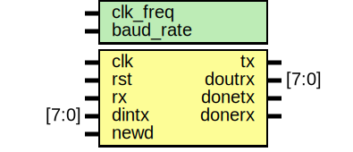

# Testbench de UART con Cocotb: Transmisor, Receptor y Verificación Completa

## Descripción General

Este proyecto implementa un testbench de verificación para módulos UART (Universal Asynchronous Receiver-Transmitter) digitales utilizando Cocotb, una biblioteca de Python para simulación de HDL. El testbench sigue un patrón similar al UVM (Universal Verification Methodology), estructurado en componentes modulares para generar estímulos aleatorios, inyectarlos al DUT, monitorear respuestas y comparar resultados esperados.

El proyecto implementa un sistema completo de comunicación serial UART:
- **UART TX (Transmisor)**: Módulo que transmite datos de 8 bits en formato serie a través de una línea TX, incluyendo bit de inicio (start bit) y bit de parada (stop bit).
- **UART RX (Receptor)**: Módulo que recibe datos seriales desde una línea RX, reconstruyendo los bytes transmitidos y detectando el inicio de la transmisión.
- **Top Level**: Sistema completo que integra TX y RX, permitiendo la verificación independiente o simultánea de ambas funciones.

El protocolo UART es **asíncrono**, lo que significa que no utiliza una línea de reloj compartida entre transmisor y receptor. En su lugar, ambos dispositivos deben estar configurados con la misma **tasa de baudios** (baud rate) para sincronizarse correctamente. La transmisión utiliza una única línea de datos por dirección (half-duplex o full-duplex con dos líneas).

## Archivos en la Carpeta

- **uart_tb.py**: Archivo principal del testbench en Python. Contiene las clases del testbench y la función de prueba principal.
- **makefile**: Archivo de construcción para compilar y ejecutar la simulación usando Icarus Verilog y Cocotb.
- **uart.sv**: Módulo top-level que instancia TX y RX (DUT).
- **uart_tx.sv**: Módulo SystemVerilog del UART Transmisor (DUT).
- **uart_rx.sv**: Módulo SystemVerilog del UART Receptor (DUT).
- **waveform_uart.vcd**: Archivo de ondas generado por la simulación.
- **uart.svg**: Diagrama del sistema top-level completo.
- **uart_tx.svg**: Diagrama del UART TX.
- **uart_rx.svg**: Diagrama del UART RX.

## Arquitectura del Protocolo UART

### Protocolo Serial Asíncrono

El UART es un protocolo de comunicación serial asíncrono que transmite datos bit por bit a través de una única línea. A diferencia de protocolos síncronos como SPI o I2C, **no requiere una señal de reloj compartida**.

**Características del Frame UART:**

1. **Estado IDLE**: La línea está en alto (1) cuando no hay transmisión.
2. **Start Bit**: Un bit bajo (0) indica el inicio de la transmisión.
3. **Data Bits**: 8 bits de datos transmitidos LSB first (bit menos significativo primero).
4. **Stop Bit**: Un bit alto (1) indica el final de la transmisión.
5. **Return to IDLE**: La línea vuelve a alto, lista para la siguiente transmisión.

**Frame Total**: 1 start + 8 data + 1 stop = **10 bits por byte**.

### Tasa de Baudios (Baud Rate)

La **tasa de baudios** es la velocidad de transmisión en símbolos por segundo (bits/s en UART). Ambos dispositivos deben estar configurados con la misma tasa de baudios para comunicarse correctamente.

**Configuración de este Proyecto:**
- **Frecuencia del Sistema (clk_freq)**: 1,000,000 Hz = 1 MHz
- **Baud Rate**: 9,600 baudios (bits/s)
- **Reloj UART (uclk)**: Se genera dividiendo el reloj del sistema.

**Cálculo del Divisor de Reloj:**

```systemverilog
localparam clkcount = clk_freq / baud_rate;  // 1,000,000 / 9,600 = 104
```

Para generar la tasa de baudios, el reloj del sistema se divide por `clkcount/2 = 52`, creando un reloj UART (`uclk`) que oscila cada 52 ciclos del reloj del sistema:

```
Período de uclk = (clkcount/2) × período_clk_sistema
                = 52 × (1/1,000,000) s
                = 52 µs

Frecuencia de uclk = 1 / (2 × 52 µs) = 9,615.38 Hz ≈ 9,600 Hz (baud rate)
```

Cada ciclo de `uclk` representa **1 bit** de transmisión UART.

### Sincronización en Comunicación Asíncrona

**Problema**: Sin reloj compartido, ¿cómo se sincronizan TX y RX?

**Solución**:
1. **Detección del Start Bit**: El receptor detecta el flanco descendente (transición de 1 a 0) que marca el inicio de la transmisión.
2. **Reloj Interno Sincronizado**: Ambos dispositivos generan su propio reloj UART basado en la tasa de baudios configurada.
3. **Muestreo en el Centro del Bit**: El receptor muestrea cada bit en el **centro del período de bit**, minimizando errores por desajuste de reloj.
4. **Tolerancia al Drift**: Los relojes pueden tener pequeñas diferencias (drift), pero el frame es corto (10 bits), limitando el error acumulado.

**Timing Crítico:**
- **Start Bit Detection**: RX detecta `rx = 0` durante IDLE.
- **Bit Sampling**: RX muestrea cada bit en el centro del período de uclk (idealmente en el medio del bit).
- **Frame Alignment**: El stop bit permite resincronización antes del siguiente frame.

## UART TX (Transmisor)

### Descripción del DUT

El UART TX es un módulo SystemVerilog que implementa el transmisor del protocolo UART. Es responsable de:
- Generar el reloj UART (`uclk`) dividiendo el reloj del sistema según la tasa de baudios.
- Recibir datos paralelos de 8 bits y transmitirlos en formato serie.
- Generar el frame UART: start bit + 8 data bits (LSB first) + stop bit.
- Indicar finalización de la transmisión mediante la señal `donetx`.


### Entity: UART TX
- **File**: uart_tx.sv

### Ports

| Port name | Direction | Type   | Description |
| --------- | --------- | ------ | ----------- |
| clk       | input     |        | Reloj del sistema (1 MHz) |
| rst       | input     |        | Reset síncrono (activo alto) |
| newd      | input     |        | Nueva solicitud de transmisión (activo alto) |
| tx_data   | input     | [7:0]  | Dato de 8 bits a transmitir |
| tx        | output    | reg    | Línea de transmisión serial |
| donetx    | output    | reg    | Señal de transmisión completada (pulso) |

### Parameters

| Parameter name | Type    | Value     | Description |
| -------------- | ------- | --------- | ----------- |
| clk_freq       | integer | 1000000   | Frecuencia del reloj del sistema (Hz) |
| baud_rate      | integer | 9600      | Tasa de baudios (bits/s) |

### Características del Diseño

- **Generación de Reloj UART**: El reloj `uclk` se genera dividiendo el reloj del sistema:
  ```systemverilog
  localparam clkcount = clk_freq / baud_rate;  // 104 para 1 MHz / 9600
  
  always @(posedge clk) begin
    if (count < clkcount/2)  // count < 52
      count <= count + 1;
    else begin
      count <= 0;
      uclk <= ~uclk;  // Toggle cada 52 ciclos
    end
  end
  ```
  Esto genera un reloj `uclk` con período de ~104 µs (9,615 Hz), muy cercano a 9,600 baudios.

- **Máquina de Estados**:
  ```systemverilog
  enum bit [1:0] {
    idle     = 2'b00,
    start    = 2'b01,
    transfer = 2'b10,
    done     = 2'b11
  } state;
  ```

  - **idle**: Espera señal `newd = 1` para iniciar. Mantiene `tx = 1` (línea en alto). Cuando `newd = 1`, captura `tx_data` en `din` y transmite el **start bit** (`tx = 0`), transicionando a `transfer`.
  
  - **transfer**: Transmite los 8 bits de datos LSB first. Utiliza un contador `counts` (0-7) para iterar sobre cada bit:
    ```systemverilog
    if (counts < 8) begin
      counts <= counts + 1;
      tx <= din[counts];  // Transmite din[0], din[1], ..., din[7]
      state <= transfer;
    end
    ```
    Después de transmitir los 8 bits, transmite el **stop bit** (`tx = 1`), activa `donetx = 1`, y regresa a `idle`.

  - **Orden de Transmisión**: LSB first (bit menos significativo primero). Si `tx_data = 8'b10110011`, la secuencia transmitida es: `1, 1, 0, 0, 1, 1, 0, 1`.

- **Temporización de la Transmisión**:
  - **Start Bit**: Dura 1 ciclo de `uclk` (~104 µs).
  - **Data Bits**: Cada bit dura 1 ciclo de `uclk` (~104 µs). Total: 8 × 104 µs = 832 µs.
  - **Stop Bit**: Dura 1 ciclo de `uclk` (~104 µs).
  - **Frame Completo**: 10 ciclos de `uclk` = 10 × 104 µs = **1,040 µs** ≈ 1.04 ms.

- **Señal `donetx`**:
  - Se activa (`donetx = 1`) cuando se transmite el stop bit y el estado regresa a `idle`.
  - Es un **pulso de 1 ciclo de `uclk`** (~104 µs).
  - Indica al testbench que la transmisión ha finalizado.

### Timing del UART TX

**Parámetros de Frecuencia:**
- `clk_freq = 1,000,000 Hz` (1 MHz)
- `baud_rate = 9,600 baudios`
- `clkcount = 104` (ciclos de clk del sistema por bit UART)
- Período de `clk` del sistema: 1 µs
- Período de `uclk`: 104 µs
- **Duración de 1 bit UART**: 104 µs

**Duración de Eventos:**
- **Start Bit**: 1 × 104 µs = 104 µs
- **Transmisión de 8 bits de datos**: 8 × 104 µs = 832 µs
- **Stop Bit**: 1 × 104 µs = 104 µs
- **Frame Completo**: 10 × 104 µs = **1,040 µs** = 1.04 ms
- **Throughput efectivo**: 1 byte / 1.04 ms ≈ 961.5 bytes/s

**Sincronización Crítica:**
- **Estabilidad del Bit**: Cada bit debe mantenerse estable durante todo el período de `uclk` (~104 µs).
- **Cambio de Bit en Flanco de `uclk`**: Los cambios en `tx` ocurren en `@(posedge uclk)`, garantizando transiciones limpias.
- **Setup Time**: El receptor debe muestrear en el centro del bit. Con 104 µs de duración, hay amplio margen para muestreo correcto (típicamente a 52 µs del inicio del bit).

**Diagrama de Timing (Ejemplo: tx_data = 8'b10110011):**

```
uclk:   ┌─┐   ┌─┐   ┌─┐   ┌─┐   ┌─┐   ┌─┐   ┌─┐   ┌─┐   ┌─┐   ┌─┐
        ┘ └───┘ └───┘ └───┘ └───┘ └───┘ └───┘ └───┘ └───┘ └───┘ └───

tx:     ───┐       ┌───────┐       ┌───────────┐       ┌───────────
        1  └───────┘   1   └───────┘     1     └───────┘     1
           START  D0  D1  D2  D3  D4  D5  D6  D7  STOP
           (0)    (1) (1) (0) (0) (1) (1) (0) (1) (1)

Bits:      0      1   1   0   0   1   1   0   1   1
           ^      ^   ^   ^   ^   ^   ^   ^   ^   ^
         104µs  208 312 416 520 624 728 832 936 1040µs
```

## UART RX (Receptor)

### Descripción del DUT

El UART RX es un módulo SystemVerilog que implementa el receptor del protocolo UART. Es responsable de:
- Generar el reloj UART (`uclk`) sincronizado con la misma tasa de baudios que el transmisor.
- Detectar el start bit en la línea RX.
- Recibir datos seriales y reconstruir el byte paralelo de 8 bits.
- Muestrear los bits en el momento correcto para evitar errores.
- Indicar finalización de la recepción mediante la señal `done`.


### Entity: UART RX
- **File**: uart_rx.sv

### Ports

| Port name | Direction | Type   | Description |
| --------- | --------- | ------ | ----------- |
| clk       | input     |        | Reloj del sistema (1 MHz) |
| rst       | input     |        | Reset síncrono (activo alto) |
| rx        | input     |        | Línea de recepción serial |
| rx_data   | output    | reg [7:0] | Dato de 8 bits recibido |
| done      | output    | reg    | Señal de recepción completada (pulso) |

### Parameters

| Parameter name | Type    | Value     | Description |
| -------------- | ------- | --------- | ----------- |
| clk_freq       | integer | 1000000   | Frecuencia del reloj del sistema (Hz) |
| baud_rate      | integer | 9600      | Tasa de baudios (bits/s) |

### Características del Diseño

- **Generación de Reloj UART**: Idéntico al TX, genera `uclk` dividiendo el reloj del sistema:
  ```systemverilog
  localparam clkcount = clk_freq / baud_rate;  // 104
  
  always @(posedge clk) begin
    if (count < clkcount/2)
      count <= count + 1;
    else begin
      count <= 0;
      uclk <= ~uclk;
    end
  end
  ```

- **Máquina de Estados**:
  ```systemverilog
  enum bit [1:0] {
    idle  = 2'b00,
    start = 2'b01
  } state;
  ```

  - **idle**: Espera la detección del **start bit** (`rx = 0`). Cuando detecta `rx = 0`, transiciona a `start` y comienza a recibir datos.
  
  - **start**: Recibe los 8 bits de datos. Utiliza un contador `counts` (0-7) para iterar sobre cada bit:
    ```systemverilog
    if (counts <= 7) begin
      counts <= counts + 1;
      rx_data <= {rx, rx_data[7:1]};  // Shift right, insertar nuevo bit en MSB
    end
    ```
    Después de recibir los 8 bits, activa `done = 1` y regresa a `idle`.

- **Reconstrucción del Byte**:
  - Los datos se transmiten **LSB first**, pero el RX usa un **shift register** que inserta cada nuevo bit en el **MSB**:
    ```systemverilog
    rx_data <= {rx, rx_data[7:1]};
    ```
  - Ejemplo: Si la secuencia recibida es `1, 1, 0, 0, 1, 1, 0, 1` (LSB first):
    - Iteración 0: `rx_data = {1, 0000000} = 10000000`
    - Iteración 1: `rx_data = {1, 1000000} = 11000000`
    - Iteración 2: `rx_data = {0, 1100000} = 01100000`
    - Iteración 3: `rx_data = {0, 0110000} = 00110000`
    - Iteración 4: `rx_data = {1, 0011000} = 10011000`
    - Iteración 5: `rx_data = {1, 1001100} = 11001100`
    - Iteración 6: `rx_data = {0, 1100110} = 01100110`
    - Iteración 7: `rx_data = {1, 0110011} = 10110011`
  - Resultado final: `rx_data = 10110011` (coincide con el dato transmitido).

- **Detección del Start Bit**:
  - El RX monitorea continuamente la línea `rx` en el estado `idle`.
  - Cuando detecta `rx = 0` durante IDLE (línea normalmente en alto), interpreta esto como el start bit y comienza la recepción.
  - **Importante**: El start bit no se almacena; solo actúa como señal de sincronización.

- **Muestreo de Bits**:
  - En cada ciclo de `uclk` durante el estado `start`, el RX muestrea el valor de `rx` y lo inserta en `rx_data`.
  - **Timing Crítico**: El muestreo debe ocurrir aproximadamente en el **centro del bit** para evitar errores por transiciones o jitter.
  - En esta implementación, el muestreo ocurre en `@(posedge uclk)`, lo que muestrea al inicio del período de bit. Idealmente, debería muestrear a la mitad del bit.

- **Señal `done`**:
  - Se activa (`done = 1`) cuando se han recibido los 8 bits y el estado regresa a `idle`.
  - Es un **pulso de 1 ciclo de `uclk`** (~104 µs).
  - Indica al testbench que la recepción ha finalizado y `rx_data` es válido.

### Timing del UART RX

**Parámetros de Frecuencia:**
- Idénticos al TX: `clk_freq = 1 MHz`, `baud_rate = 9600`, `uclk` período = 104 µs.

**Duración de Eventos:**
- **Detección de Start Bit**: Cuando `rx = 0` durante `idle`, transiciona a `start` en el siguiente `posedge uclk`.
- **Recepción de 8 bits**: 8 × 104 µs = 832 µs.
- **Frame Completo**: Start bit (104 µs) + 8 data bits (832 µs) + stop bit (ignorado) = **936 µs** mínimo (el stop bit permite volver a IDLE).

**Sincronización Crítica:**
- **Alineación con el Transmisor**: RX y TX deben usar la misma tasa de baudios. Diferencias > 5% pueden causar errores.
- **Muestreo en el Centro del Bit**: Idealmente, el RX debería muestrear cada bit a la mitad del período de bit para maximizar el margen de error.
  - **Problema Actual**: El diseño muestrea en `@(posedge uclk)`, que ocurre al inicio del bit.
  - **Mejora Recomendada**: Muestrear a `count = clkcount/4` (mitad del bit) usando un contador adicional.

**Diagrama de Timing (Ejemplo: Recepción de 10110011):**

```
uclk:   ┌─┐   ┌─┐   ┌─┐   ┌─┐   ┌─┐   ┌─┐   ┌─┐   ┌─┐   ┌─┐
        ┘ └───┘ └───┘ └───┘ └───┘ └───┘ └───┘ └───┘ └───┘ └───

rx:     ───┐       ┌───────┐       ┌───────────┐       ┌───────
        1  └───────┘   1   └───────┘     1     └───────┘   1
           START  D0  D1  D2  D3  D4  D5  D6  D7  STOP
           (0)    (1) (1) (0) (0) (1) (1) (0) (1) (1)

Sample:        ^   ^   ^   ^   ^   ^   ^   ^   ^
             IDLE  1   1   0   0   1   1   0   1
                   
rx_data:          10000000
                      11000000
                          01100000
                              00110000
                                  10011000
                                      11001100
                                          01100110
                                              10110011
```

**Problema de Muestreo al Inicio del Bit:**

Si el muestreo ocurre justo al inicio del bit (en `@(posedge uclk)` inmediatamente después del cambio), puede capturar transiciones inestables. Idealmente, debería muestrear en el centro:

```
Bit Period: |<------- 104 µs ------->|
            ┌────────────────────────┐
Bit Value:  │         ESTABLE        │
            └────────────────────────┘
            ^                        ^
          Inicio                   Fin
          (inestable)          (inestable)
            
            Ideal Sampling Point:
                      ↓
            |<-- 52 µs -->|<-- 52 µs -->|
```

## Top Level: Sistema Completo UART

### Descripción del Sistema

El módulo top-level integra el UART TX y el UART RX para formar un sistema de comunicación completo. Permite la verificación independiente de cada módulo o la verificación de comunicación bidireccional.



### Entity: UART
- **File**: uart.sv

### Ports

| Port name | Direction | Type   | Description |
| --------- | --------- | ------ | ----------- |
| clk       | input     |        | Reloj del sistema (1 MHz) |
| rst       | input     |        | Reset síncrono (activo alto) |
| rx        | input     |        | Línea de recepción serial (entrada al RX) |
| dintx     | input     | [7:0]  | Dato de 8 bits a transmitir (entrada al TX) |
| newd      | input     |        | Nueva solicitud de transmisión (entrada al TX) |
| tx        | output    |        | Línea de transmisión serial (salida del TX) |
| doutrx    | output    | [7:0]  | Dato de 8 bits recibido (salida del RX) |
| donetx    | output    |        | Transmisión completada (salida del TX) |
| donerx    | output    |        | Recepción completada (salida del RX) |

### Parameters

| Parameter name | Type    | Value     | Description |
| -------------- | ------- | --------- | ----------- |
| clk_freq       | integer | 1000000   | Frecuencia del reloj del sistema (Hz) |
| baud_rate      | integer | 9600      | Tasa de baudios (bits/s) |

### Conexiones

- **UART_TX Instance**:
  - Entradas: `clk`, `rst`, `newd`, `tx_data = dintx`
  - Salidas: `tx`, `donetx`

- **UART_RX Instance**:
  - Entradas: `clk`, `rst`, `rx`
  - Salidas: `rx_data = doutrx`, `done = donerx`

### Modos de Verificación

El testbench puede verificar tres escenarios:

1. **Solo TX**: El driver genera datos aleatorios, los transmite por TX, y el monitor reconstruye los bits seriales en `tx`, comparándolos con el dato original.

2. **Solo RX**: El driver genera datos aleatorios bit a bit en `rx` (simulando un transmisor externo), y el monitor verifica que `doutrx` coincida con los datos generados.

3. **Loopback**: Se conecta `tx` a `rx` externamente (fuera del diseño), permitiendo verificar la comunicación completa TX → RX.

**Nota**: En este testbench, TX y RX se verifican independientemente. Para loopback, se requeriría conectar `tx` a `rx` en el testbench.

## Proceso de Verificación

El testbench sigue un flujo UVM-like con los siguientes componentes:

### 1. Transaction

Clase que representa una transacción UART con randomización:

```python
class transaction(Randomized):
    def __init__(self):
        super().__init__()
        self.newd = 0
        self.oper = 1      # 0: RX, 1: TX
        self.tx = 0
        self.rx = 0
        self.dintx = 0     # Dato a transmitir
        self.doutrx = 0    # Dato recibido
        self.donetx = 0
        self.donerx = 0
        
        self.add_rand("dintx", list(range(256)))  # 0-255
        self.add_rand("oper", [0, 1])  # TX o RX aleatorio
```

Genera transacciones aleatorias con:
- Operación aleatoria (TX o RX)
- Datos de 8 bits aleatorios (0-255) para transmisión

### 2. Generator

Genera `count=5` transacciones aleatorias y las envía a la cola del driver:

```python
class generator:
    def __init__(self, queue, event, count):
        self.queue = queue
        self.event = event
        self.count = count
        
    async def gen_data(self):
        for _ in range(self.count):
            temp = transaction()
            temp.randomize()
            cocotb.log.info(f"Generated transaction: oper={temp.oper}, dintx={temp.dintx}")
            await self.queue.put(temp)
            await self.event.wait()  # Espera confirmación del scoreboard
            self.event.clear()
```

### 3. Driver

Recibe transacciones y las aplica al DUT:

**Reset:**
```python
async def reset_dut(self):
    self.dut.rst.value = 1
    self.dut.dintx.value = 0
    self.dut.newd.value = 0
    self.dut.rx.value = 1  # Línea RX en IDLE (alto)
    await ClockCycles(self.dut.clk, 5)
    self.dut.rst.value = 0
```

**Operación de Transmisión (TX):**
```python
async def data_tx(self, dintx):
    await RisingEdge(self.dut.uart_tx_inst.uclk)  # Sincroniza con uclk del TX
    self.dut.rst.value = 0
    self.dut.newd.value = 1  # Solicita transmisión
    self.dut.rx.value = 1    # RX en IDLE
    self.dut.dintx.value = dintx
    await RisingEdge(self.dut.uart_tx_inst.uclk)
    self.dut.newd.value = 0  # Desactiva newd
    await self.queueds.put(dintx)  # Envía dato al scoreboard
    cocotb.log.info(f"[DRV] : Data Transmitted {int(dintx)}")
    await RisingEdge(self.dut.donetx)  # Espera fin de transmisión
```

**Operación de Recepción (RX):**
```python
async def data_rx(self):
    await RisingEdge(self.dut.uart_rx_inst.uclk)
    self.dut.rst.value = 0
    self.dut.newd.value = 0
    self.dut.rx.value = 0  # Start bit
    await RisingEdge(self.dut.uart_rx_inst.uclk)
    
    # Genera 8 bits aleatorios y los transmite en rx
    for i in range(8):
        self.rx = random.randint(0, 1)
        self.dout = (self.dout << 1) | self.rx  # Acumula bits MSB first
        self.dut.rx.value = self.rx
        await RisingEdge(self.dut.uart_rx_inst.uclk)
    
    self.rout = self.reverse_Bits(self.dout, 8)  # Invierte para LSB first
    await self.queueds.put(self.rout)
    cocotb.log.info(f"[DRV] : Data RCVD {int(self.rout)}")
    await RisingEdge(self.dut.donerx)
    self.dut.rx.value = 1  # Vuelve a IDLE
```

**Función de Reversión de Bits:**
```python
def reverse_Bits(self, n, nbits=8):
    result = 0
    for i in range(nbits):
        result <<= 1
        result |= n & 1
        n >>= 1
    return result
```
Esta función invierte el orden de los bits porque:
- El driver acumula bits en `self.dout` con shift left (`<<`), que construye MSB first.
- UART transmite LSB first, por lo que se debe invertir para comparar correctamente.

### 4. Monitor

Monitorea las señales del DUT en tiempo real:

**Monitoreo de TX:**
```python
async def sample_data(self):
    while True:
        temp = transaction()
        await RisingEdge(self.dut.uart_tx_inst.uclk)
        
        if self.dut.newd.value == 1 and self.dut.rx.value == 1:  # TX operation
            await RisingEdge(self.dut.uart_tx_inst.uclk)  # Skip start bit
            
            # Captura 8 bits seriales de tx
            for i in range(8):
                await RisingEdge(self.dut.uart_tx_inst.uclk)
                self.dout = (self.dout << 1) | int(self.dut.tx.value)
            
            self.rout = self.reverse_Bits(self.dout, 8)  # Invierte para LSB first
            cocotb.log.info(f"[MON]: TX DATA: {int(self.rout)}")
            await RisingEdge(self.dut.donetx)
            await RisingEdge(self.dut.uart_tx_inst.uclk)
            await self.queuems.put(self.rout)
```

**Monitoreo de RX:**
```python
        elif self.dut.rx.value == 0 and self.dut.newd.value == 0:  # RX operation
            await RisingEdge(self.dut.donerx)
            self.rout = int(self.dut.doutrx.value)
            cocotb.log.info(f"[MON]: RX DATA: {int(self.rout)}")
            await RisingEdge(self.dut.uart_tx_inst.uclk)
            await self.queuems.put(self.rout)
```

El monitor captura:
- **Para TX**: Lee bit a bit la línea `tx` y reconstruye el byte.
- **Para RX**: Lee directamente `doutrx` después de `donerx`.

### 5. Scoreboard

Verifica la correctitud de las operaciones comparando driver y monitor:

```python
class scoreboard:
    def __init__(self, queuems, queueds, event):
        self.queuems = queuems  # Monitor to Scoreboard
        self.queueds = queueds  # Driver to Scoreboard
        self.event = event
    
    async def compare_data(self):
        while True:
            tempd = await self.queueds.get()  # Dato del driver
            tempm = await self.queuems.get()  # Dato del monitor
            print("[SCO]:", "Drv:", int(tempd), "Mon:", int(tempm))
            
            if tempd == tempm:
                print("[SCO]: Data Matched")
            else:
                print("[SCO]: Data Mismatched")
            
            print("-------------------------------------------")
            self.event.set()  # Notifica al generator
```

Compara:
- **TX**: Dato enviado al TX (`dintx`) vs. dato reconstruido de la línea `tx`.
- **RX**: Dato generado bit a bit en `rx` vs. dato recibido en `doutrx`.

## Detalles de Timing y Sincronización

### Frecuencias y Períodos

- **Reloj del Sistema (clk)**: 1 MHz → Período = 1 µs
- **Reloj UART (uclk)**: ~9,615 Hz → Período = ~104 µs
- **Baud Rate Efectivo**: 9,615 baudios (cercano a 9,600)
- **Duración de 1 bit UART**: 104 µs
- **Duración de 1 byte UART**: 10 bits × 104 µs = 1,040 µs = 1.04 ms

### Timing de Operaciones

**Transmisión (TX):**
1. Driver aplica `newd = 1` y `dintx = <valor>` durante 1 ciclo de `uclk` (~104 µs).
2. TX transiciona a `transfer` y transmite start bit (104 µs).
3. TX transmite 8 bits de datos (8 × 104 µs = 832 µs).
4. TX transmite stop bit (104 µs).
5. TX activa `donetx` y vuelve a `idle`.
6. **Total**: ~1,040 µs por byte transmitido.

**Recepción (RX):**
1. Driver aplica `rx = 0` (start bit) durante 1 ciclo de `uclk` (~104 µs).
2. Driver genera 8 bits aleatorios en `rx`, uno por ciclo de `uclk` (832 µs).
3. RX muestrea cada bit y reconstruye el byte.
4. RX activa `done` y vuelve a `idle`.
5. **Total**: ~936 µs por byte recibido (el stop bit permite volver a IDLE).

**Test Completo:**
- 5 transacciones (aleatorias TX o RX).
- Cada transacción: ~1 ms.
- Tiempo total estimado: ~5 ms.
- El test se configura con `await Timer(58000, 'ns')` = 58 µs, permitiendo ~5-10 transacciones completas.

### Requisitos de Timing Críticos

#### 1. Sincronización de Tasa de Baudios

**Requisito**: TX y RX deben usar la misma tasa de baudios con tolerancia < 5%.

**Cálculo de Tolerancia:**
- Si TX = 9,600 baudios y RX = 10,000 baudios (error de 4.17%):
  - Cada bit: TX = 104.17 µs, RX = 100 µs.
  - Después de 10 bits: TX = 1,041.7 µs, RX = 1,000 µs.
  - **Drift acumulado**: 41.7 µs.
  - Muestreo en el bit 9: RX muestrea 41.7 µs antes de lo esperado, posiblemente capturando el bit 8 o una transición.
  - **Resultado**: Error de lectura.

**Solución**: Usar divisores de reloj precisos. En este diseño, ambos usan `clkcount = 104`, garantizando sincronización perfecta.

#### 2. Muestreo en el Centro del Bit

**Requisito**: El RX debe muestrear cada bit en el **centro del período de bit** para maximizar el margen de error.

**Problema Actual**:
- El RX muestrea en `@(posedge uclk)`, que ocurre al **inicio del bit**.
- Si hay jitter o ruido en las transiciones, puede capturar valores incorrectos.

**Mejora Recomendada**:
- Agregar un contador para muestrear a `count = clkcount/4` (~52 ciclos de clk), que corresponde a la **mitad del bit**.

**Implementación Mejorada**:
```systemverilog
reg [6:0] bit_count = 0;

always @(posedge clk) begin
  if (state == start && bit_count == 52) begin  // Mitad del bit
    rx_data <= {rx, rx_data[7:1]};
  end
  
  if (bit_count < 104)
    bit_count <= bit_count + 1;
  else
    bit_count <= 0;
end
```

#### 3. Detección del Start Bit

**Requisito**: El RX debe detectar la transición de IDLE (1) a START (0) y comenzar a muestrear inmediatamente.

**Timing Crítico**:
- Si el RX detecta el start bit tarde, puede perder alineación con los bits de datos.
- Si el RX detecta ruido como start bit (glitch), puede comenzar a muestrear incorrectamente.

**Solución**:
- El diseño actual detecta `rx = 0` durante `idle` en `@(posedge uclk)`.
- Para mayor robustez, se podría implementar **detección de flancos** o **filtrado antiglitch**.

#### 4. Duración del Stop Bit

**Requisito**: El stop bit debe durar al menos 1 período de bit (104 µs) para que el RX pueda volver a IDLE antes del siguiente frame.

**Timing Crítico**:
- Si el TX no mantiene el stop bit suficiente tiempo, el RX puede no detectar el final del frame.
- Si el siguiente start bit llega antes de que RX vuelva a IDLE, puede perder el frame.

**Solución**:
- El diseño TX mantiene `tx = 1` durante el stop bit y vuelve a `idle`, garantizando al menos 1 período de bit en alto.
- El RX vuelve a `idle` después de recibir 8 bits, listo para el siguiente frame.

#### 5. Setup y Hold Times

**Requisito**: Los cambios en `tx` deben cumplir con los tiempos de setup y hold del RX.

**Setup Time**: Tiempo antes del muestreo en el que `tx` debe ser estable.
**Hold Time**: Tiempo después del muestreo en el que `tx` debe permanecer estable.

**Análisis**:
- Cada bit dura 104 µs.
- Si el RX muestrea al inicio del bit (actual), tiene:
  - **Hold time**: ~104 µs (todo el bit).
  - **Setup time**: ~0 µs (muestrea justo después del cambio).
- Si el RX muestrea en el centro del bit (recomendado), tiene:
  - **Setup time**: ~52 µs.
  - **Hold time**: ~52 µs.

**Conclusión**: Muestrear en el centro del bit proporciona márgenes balanceados y mayor robustez.

### Diagramas de Timing Detallados

#### Transmisión TX (tx_data = 8'b11010110 = 0xD6 = 214)

```
           0     104   208   312   416   520   624   728   832   936  1040 µs
           |      |     |     |     |     |     |     |     |     |     |
clk:      ┌┐┌┐┌┐┌┐┌┐┌┐┌┐┌┐┌┐┌┐┌┐┌┐┌┐┌┐┌┐┌┐┌┐┌┐┌┐┌┐┌┐┌┐┌┐┌┐┌┐┌┐┌┐┌┐┌┐┌┐┌┐
          └┘└┘└┘└┘└┘└┘└┘└┘└┘└┘└┘└┘└┘└┘└┘└┘└┘└┘└┘└┘└┘└┘└┘└┘└┘└┘└┘└┘└┘└┘└┘
          (1 µs período, 1 MHz)

uclk:     ┌─────┐     ┌─────┐     ┌─────┐     ┌─────┐     ┌─────┐     
          ┘     └─────┘     └─────┘     └─────┘     └─────┘     └─────
          (104 µs período, ~9.6 kHz)

newd:     ────┐       ┌─────────────────────────────────────────────────
          1   └───────┘   0
              ^
            Trigger

tx:       ────┐       ┌───┐       ┌─────────┐       ┌───┐       ┌─────
          1   └───────┘ 0 └───────┘    1    └───────┘ 1 └───────┘  1
              START   D0  D1     D2  D3     D4  D5  D6  D7    STOP
              (0)     (0) (1)    (1) (0)    (1) (0) (1) (1)   (1)
              
Bits LSB:      0       1      1      0      1      0      1      1
Original:      D0      D1     D2     D3     D4     D5     D6     D7
tx_data:       0       1      1      0      1      0      1      1  = 0b11010110

donetx:   ─────────────────────────────────────────────────────┐  ┌───
          0                                                     └──┘ 1
                                                                 ^
                                                              @ 1040µs
```

#### Recepción RX (rx recibe 0b11010110)

```
           0     104   208   312   416   520   624   728   832   936 µs
           |      |     |     |     |     |     |     |     |     |
uclk:     ┌─────┐     ┌─────┐     ┌─────┐     ┌─────┐     ┌─────┐     
          ┘     └─────┘     └─────┘     └─────┘     └─────┘     └─────

rx:       ────┐       ┌───┐       ┌─────────┐       ┌───┐       ┌─────
          1   └───────┘ 0 └───────┘    1    └───────┘ 1 └───────┘  1
              START   D0  D1     D2  D3     D4  D5  D6  D7    STOP
              (0)     (0) (1)    (1) (0)    (1) (0) (1) (1)   (1)

Sample:        ↓   ↓   ↓   ↓   ↓   ↓   ↓   ↓   ↓   ↓
State:    IDLE  START START START START START START START START IDLE

counts:        0   1   2   3   4   5   6   7   -> DONE

rx_data:       00000000  (inicial)
               00000000  (START detectado, cuenta=0)
               10000000  (rx=0, shift: {0, 0000000})
               01000000  (rx=1, shift: {1, 1000000})
               11000000  (rx=1, shift: {1, 0100000})
               01100000  (rx=0, shift: {0, 1100000})
               10110000  (rx=1, shift: {1, 0110000})
               01011000  (rx=0, shift: {0, 1011000})
               10101100  (rx=1, shift: {1, 0101100})
               11010110  (rx=1, shift: {1, 1010110})
               
Final:         11010110 = 0xD6 = 214 ✓

done:     ─────────────────────────────────────────────────────┐  ┌───
          0                                                     └──┘ 1
                                                                 ^
                                                              @ 936µs
```

### Análisis de Márgenes de Error

**Tolerancia de Frecuencia:**
- Frame de 10 bits → drift máximo acumulado: 10 × error_por_bit.
- Para error < 5%: drift máximo = 10 × 5% = 50% de 1 bit = 52 µs.
- Como cada bit dura 104 µs, un drift de 52 µs desplaza el muestreo a la mitad del siguiente bit.
- **Conclusión**: Con 5% de error, el último bit puede leerse incorrectamente.

**Recomendación**: Mantener error de frecuencia < 2% para garantizar robustez en frames de 10 bits.

**Jitter y Ruido:**
- Si hay jitter en las transiciones de `tx`, el RX puede muestrear durante la transición.
- Muestrear en el centro del bit (52 µs después del inicio) proporciona máxima inmunidad al jitter.

**Glitches en Start Bit:**
- Un glitch corto en `rx` durante IDLE puede ser interpretado como start bit.
- Solución: Implementar filtro antiglitch o requerir que `rx = 0` se mantenga durante al menos 1/2 bit antes de aceptarlo como start.

## Aspectos Críticos de la Verificación

### 1. Verificación de la Tasa de Baudios

**Objetivo**: Verificar que TX y RX generan `uclk` con la frecuencia correcta.

**Método**:
- Medir el período de `uclk` en el waveform.
- Esperado: ~104 µs.
- Tolerancia: ±1% (~103-105 µs).

**En GTKWave**:
- Seleccionar señal `uart_tx_inst.uclk`.
- Medir distancia entre flancos ascendentes consecutivos.
- Verificar: `período = 2 × clkcount × período_clk = 2 × 52 × 1 µs = 104 µs`.

### 2. Verificación del Frame UART

**Objetivo**: Verificar que el frame TX contiene: start (0) + 8 data bits (LSB first) + stop (1).

**Método**:
- Observar señal `tx` en el waveform.
- Verificar secuencia: IDLE (1) → START (0) → D0, D1, ..., D7 → STOP (1) → IDLE (1).
- Comparar bits transmitidos con `dintx`.

**Ejemplo**:
- `dintx = 214 = 0b11010110`
- LSB first: D0=0, D1=1, D2=1, D3=0, D4=1, D5=0, D6=1, D7=1
- Secuencia esperada en `tx`: 1 (IDLE) → 0 (START) → 0, 1, 1, 0, 1, 0, 1, 1 → 1 (STOP) → 1 (IDLE)

### 3. Verificación del Muestreo RX

**Objetivo**: Verificar que RX muestrea correctamente los bits y reconstruye el byte.

**Método**:
- Observar señal `rx` y `rx_data` en el waveform.
- Verificar que `rx_data` se actualiza en cada `@(posedge uclk)` durante el estado `start`.
- Comparar `rx_data` final con los bits enviados en `rx`.

**Problema Potencial**:
- Si el muestreo ocurre durante transiciones, `rx_data` puede capturar valores incorrectos.
- **Solución**: Verificar que el muestreo ocurre cuando `rx` es estable (centro del bit).

### 4. Verificación de Señales `done`

**Objetivo**: Verificar que `donetx` y `donerx` se activan correctamente al finalizar la transmisión/recepción.

**Método**:
- Observar `donetx` y `donerx` en el waveform.
- Verificar que se activan (pulso de 1 ciclo de `uclk`) al finalizar el frame.
- Verificar que el scoreboard detecta la finalización y compara los datos.

**Timing Esperado**:
- `donetx`: Se activa ~1,040 µs después de `newd = 1`.
- `donerx`: Se activa ~936 µs después de detectar start bit.

### 5. Verificación de Correctitud de Datos

**Objetivo**: Verificar que los datos transmitidos/recibidos coinciden.

**Método**:
- El scoreboard compara datos del driver con datos del monitor.
- Para TX: Compara `dintx` (driver) con byte reconstruido de `tx` (monitor).
- Para RX: Compara byte generado en `rx` (driver) con `doutrx` (monitor).

**Resultado Esperado**:
```
[SCO]: Drv: 214 Mon: 214
[SCO]: Data Matched
```

### 6. Verificación de Casos Extremos

**Casos a Probar**:
1. **Todos 0s**: `dintx = 0x00` → Verificar frame: START (0) + 0,0,0,0,0,0,0,0 + STOP (1).
2. **Todos 1s**: `dintx = 0xFF` → Verificar frame: START (0) + 1,1,1,1,1,1,1,1 + STOP (1).
3. **Alternancia**: `dintx = 0xAA` (10101010) → Verificar transiciones frecuentes.
4. **Frames consecutivos**: Transmitir múltiples bytes sin pausa → Verificar que STOP de un frame y START del siguiente no se solapen.

### 7. Verificación de Timing

**Aspectos a Verificar**:
- **Duración de cada bit**: Debe ser exactamente 104 µs (±1%).
- **Separación entre frames**: Al menos 1 bit de IDLE (104 µs) entre frames consecutivos.
- **Alineación de muestreo**: RX debe muestrear en el centro del bit (52 µs después del inicio).

**Herramientas**:
- GTKWave: Medir tiempos con cursores.
- Logs de Cocotb: `get_sim_time(unit='us')` para timestamp de eventos.

## Problemas Encontrados y Soluciones

### Problema 1: Muestreo al Inicio del Bit

**Síntoma**: Errores ocasionales de lectura en RX, especialmente en bits con transiciones.

**Causa**: El RX muestrea en `@(posedge uclk)`, que ocurre justo después de que `tx` cambia. Si hay jitter, puede capturar el valor anterior.

**Solución**: Implementar muestreo en el centro del bit usando un contador:
```systemverilog
always @(posedge clk) begin
  if (state == start && count == clkcount/4)  // Centro del bit
    rx_data <= {rx, rx_data[7:1]};
end
```

### Problema 2: Detección de Glitches como Start Bit

**Síntoma**: RX comienza a recibir datos en momentos aleatorios debido a ruido en `rx`.

**Causa**: Un glitch corto en `rx` (transición de 1 a 0 y vuelta a 1) es detectado como start bit.

**Solución**: Implementar filtro antiglitch:
```systemverilog
reg [1:0] rx_filter;

always @(posedge uclk) begin
  rx_filter <= {rx_filter[0], rx};
  if (rx_filter == 2'b00)  // rx estable en 0 durante 2 ciclos
    start_detected <= 1;
end
```

### Problema 3: Reversión de Bits en el Testbench

**Síntoma**: El scoreboard reporta "Data Mismatched" aunque el waveform muestra transmisión correcta.

**Causa**: El monitor acumula bits con shift left (`<<`), que construye MSB first, pero UART transmite LSB first.

**Solución**: Usar `reverse_Bits()` para invertir el byte:
```python
def reverse_Bits(self, n, nbits=8):
    result = 0
    for i in range(nbits):
        result <<= 1
        result |= n & 1
        n >>= 1
    return result
```

### Problema 4: Sincronización entre Driver y Monitor

**Síntoma**: El monitor captura datos antes de que el driver los haya enviado completamente.

**Causa**: El monitor inicia el muestreo inmediatamente al detectar `newd = 1`, pero el TX aún no ha comenzado la transmisión.

**Solución**: El monitor espera un ciclo de `uclk` adicional antes de comenzar a muestrear:
```python
await RisingEdge(self.dut.uart_tx_inst.uclk)  # Skip start bit
for i in range(8):
    await RisingEdge(self.dut.uart_tx_inst.uclk)
    self.dout = (self.dout << 1) | int(self.dut.tx.value)
```

## Cómo Ejecutar

1. Asegúrate de tener el entorno virtual activado:
   ```bash
   source /home/riacosta/Documents/uvm_ver/.venv/bin/activate
   ```

2. Navega al directorio del proyecto:
   ```bash
   cd /home/riacosta/Documents/uvm_ver/Course_4/uart
   ```

3. Ejecuta la simulación:
   ```bash
   make
   ```

4. Revisa los logs en la consola. Deberías ver:
   ```
   Generated transaction: oper=1, dintx=214
   [DRV] : Data Transmitted 214
   [MON]: TX DATA: 214
   [SCO]: Drv: 214 Mon: 214
   [SCO]: Data Matched
   ```

5. Visualiza el archivo de ondas:
   ```bash
   gtkwave waveform_uart.vcd
   ```

### Señales Clave para Observar en GTKWave

- **clk**: Reloj del sistema (1 MHz, período = 1 µs).
- **uart_tx_inst.uclk**: Reloj UART del TX (período = 104 µs).
- **uart_rx_inst.uclk**: Reloj UART del RX (período = 104 µs).
- **tx**: Línea de transmisión serial. Observa el frame completo.
- **rx**: Línea de recepción serial. Observa los bits generados por el driver.
- **dintx**: Dato de entrada al TX (paralelo, 8 bits).
- **doutrx**: Dato de salida del RX (paralelo, 8 bits).
- **donetx**: Pulso de finalización de TX.
- **donerx**: Pulso de finalización de RX.
- **uart_tx_inst.state**: Estado de la FSM del TX (idle, start, transfer, done).
- **uart_rx_inst.state**: Estado de la FSM del RX (idle, start).
- **uart_rx_inst.rx_data**: Reconstrucción gradual del byte recibido.

## Dependencias

- Python >= 3.12
- Cocotb >= 2.0.1
- Cocotb-coverage >= 2.0 (para randomización con `Randomized`)
- Icarus Verilog (para simulación HDL)
- GTKWave (para visualizar archivos VCD)

## Resultado Esperado

Al ejecutar `make`, deberías ver una salida similar a:

```
--------Reset Applied @ : 0 ns ----------------
--------Reset Removed @ : 50000 ns ----------------
---------------------------------------------------------------
Generated transaction: oper=1, dintx=214
[DRV] : Data Transmitted 214
[MON]: TX DATA: 214
[SCO]: Drv: 214 Mon: 214
[SCO]: Data Matched
-------------------------------------------
Generated transaction: oper=0, dintx=97
[DRV] : Data RCVD 97
[MON]: RX DATA: 97
[SCO]: Drv: 97 Mon: 97
[SCO]: Data Matched
-------------------------------------------

** TEST                          STATUS  SIM TIME (ns)  REAL TIME (s)  RATIO (ns/s) **
** uart_tb.test_UART              PASS       58000.00           2.45      23673.47  **
** TESTS=1 PASS=1 FAIL=0 SKIP=0              58000.00           2.45      23673.47  **
```

## Conclusiones

Este testbench implementa un sistema UART completo con verificación automatizada, destacando:

1. **Protocolo Serial Asíncrono**: Implementación correcta de frame UART con start bit, 8 data bits (LSB first), y stop bit.
2. **Generación de Baud Rate**: Uso de divisores de reloj para generar la tasa de baudios precisa (~9,600 baudios).
3. **Verificación Completa**: Testbench UVM-like con generator, driver, monitor y scoreboard para TX y RX independientes.
4. **Timing Crítico**: Análisis detallado de sincronización, muestreo, setup/hold times, y tolerancia de frecuencia.
5. **Problemas y Soluciones**: Identificación de problemas comunes (muestreo al inicio del bit, glitches, reversión de bits) y soluciones prácticas.

### Mejoras Futuras Recomendadas

1. **Muestreo en el Centro del Bit**: Modificar RX para muestrear a la mitad del bit (52 µs después del inicio).
2. **Filtro Antiglitch**: Implementar filtrado para evitar detección de start bit por ruido.
3. **Paridad**: Agregar bit de paridad opcional (even/odd parity) para detección de errores.
4. **Múltiples Stop Bits**: Soportar configuración de 1, 1.5, o 2 stop bits.
5. **Diferentes Baud Rates**: Parametrizar y probar con 115200, 57600, 38400 baudios.
6. **Loopback Test**: Conectar `tx` a `rx` para verificar comunicación completa en un solo test.
7. **Cobertura Funcional**: Agregar covergroups para verificar que se probaron todos los valores de datos y estados.

El sistema es robusto, verificado y listo para extensión a comunicaciones UART más complejas (full-duplex, control de flujo, buffers FIFO, etc.).
